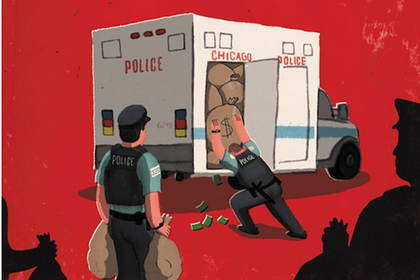
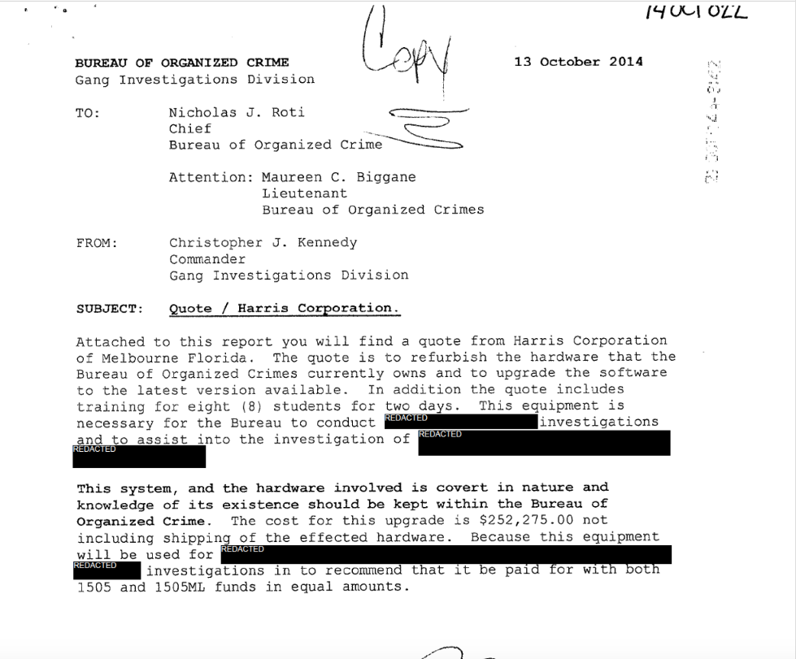
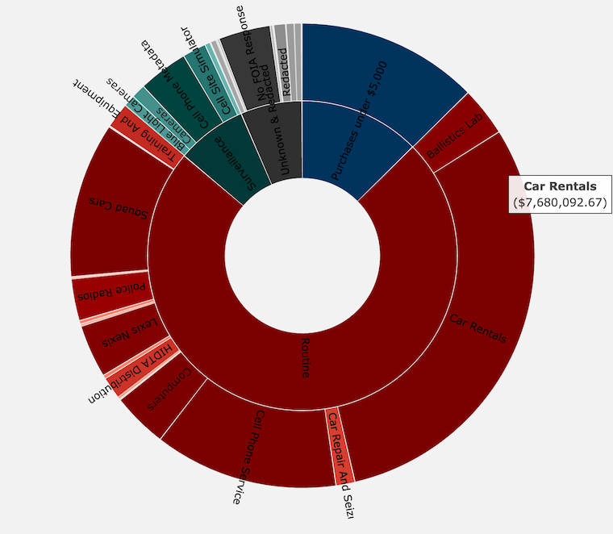
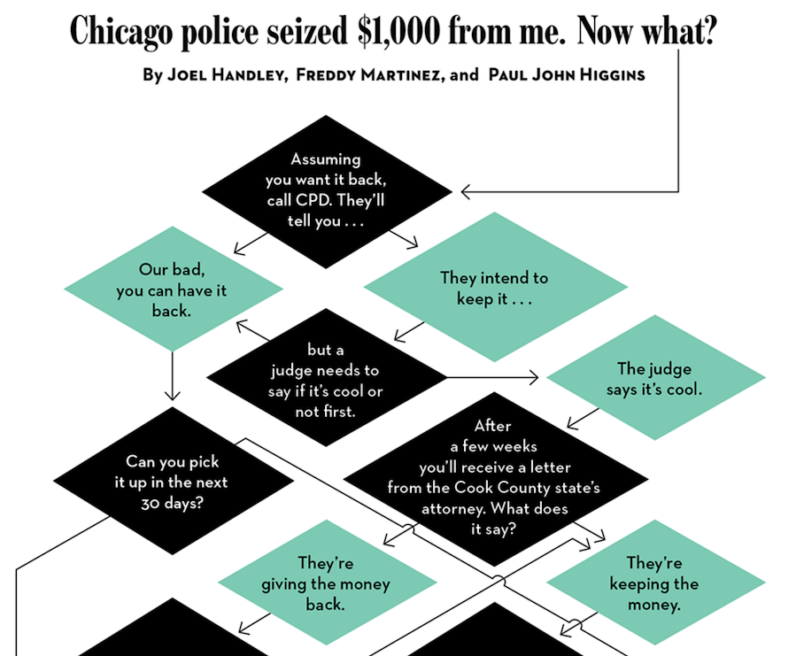
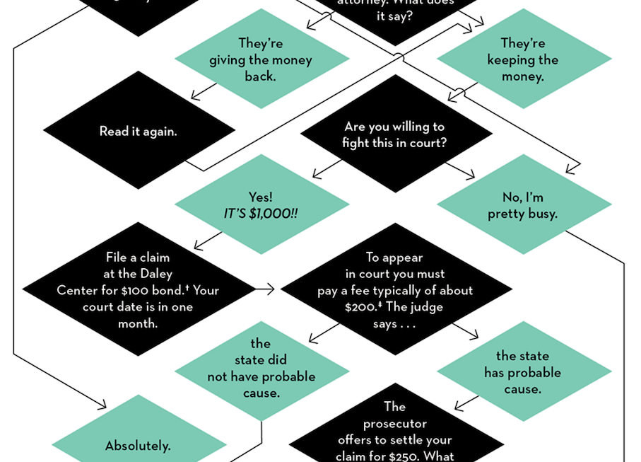
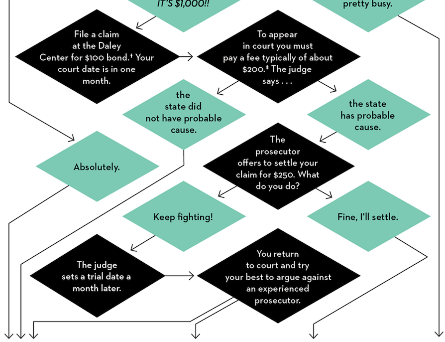
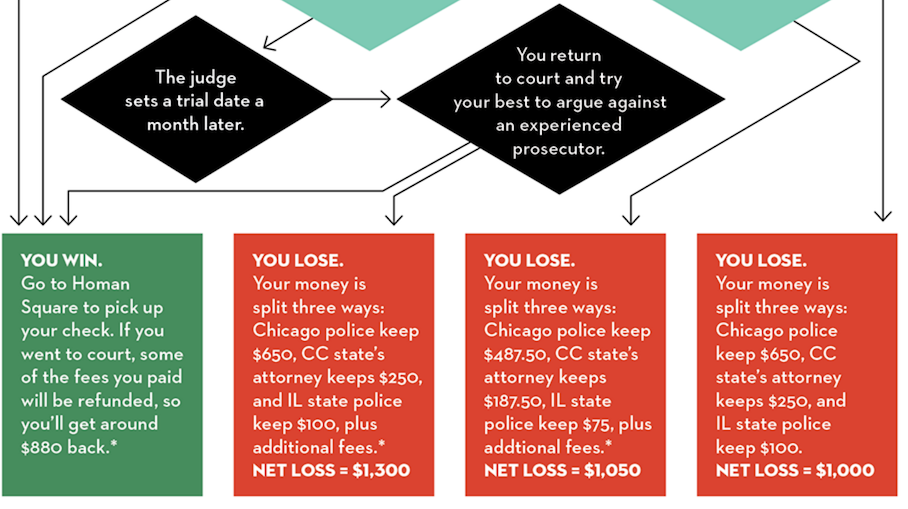
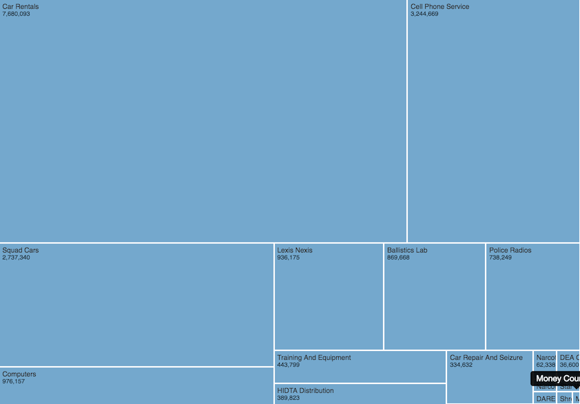
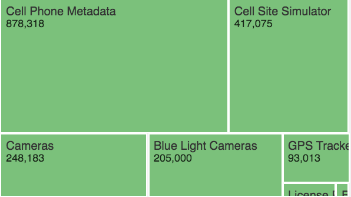

:title: Lucy Parsons Labs
:author: b_meson, joel_handley
:description: Civil asset forfeiture investigation
:keywords: journalism, 1505, civil asset forfeiture
:css: hacknight.css

----

Joel Handley (``@Joel_Handley``) & Freddy Martinez (``@B_meson``)

for Chicago Reader (``@Chicago_Reader``) and (``@lucyparsonslabs``)

.. note::

    Also mention Jen Helsby our fantastic collaborator.

----

Background
==========

Joel had previously published *To Surveil and Protect* at **In These Times** about Chicago Police Department's use of Automatic License Plate Readers and other surveillance tools. 
Freddy was working on an investigation into the use of *Stingrays* by CPD and got documents through FOIA lawsuits to show funding came from 1505 / 1505 ML funds.

----

----

Chi Hack Night pt 1
===================

Five months ago when we presented at CHN we said our "story was coming soon". The investigation was about a year and a half long, thousands of pages of documents, several dozen FOIAs, a few lawsuits and multiple trips to Courts....

----

1505
====

Illinois Statute that creates the legal authority for civil asset forfeiture. 

----

* Since 2009, CPD has brought in nearly $72 million in cash and assets through civil forfeiture, keeping nearly $47 million for itself and sending on almost $18 million to the Cook County state's attorney's office and almost $7.2 million to the Illinois State Police

* Money is not allocated as part of a regular budget.

* Most of the money went to routine spending on the war on drugs but 9% went to fund controversial surveillance equipment. 

.. note::

    Started to keep electronic records in 2009 which is why we started asking them then

----

``http://www.chicagoreader.com/chicago/police-department-civil-forfeiture-investigation/Content?oid=23728922``

----

How does it look?
=================

First, officers stop you and seize property they *suspect* of being involved in illegal activity. Then they submit paperwork to CCSAO office who sends notice to you that they intend to keep the property. The seizure is one step, convincing a court to let them *keep* the property permanently is a separate step. 

----

Seizure & Start of Civil Asset Forfeiture
``http://www.chicagoreader.com/general/civil-forfeiture/cpd-forfeiture-flowchart-01.png``

.. note::

    Interactive chart here

----

----

----

----

----

* Evidentiary threshold is quite low for State but quite high for claimant (claimant is person seeking return of property).

* Since this is a civil action there is no requirement for State appointed attorneys

* Average seizure is about $530, according to Institute for Justice

.. note::

    Re-iterate this is civil action, so lots of legal protections are not there for most people. 

----

Open Questions
==============

 * What is the racial breakdown of people getting their property seized?

 * What is the breakdown of seizures by amount? 

 * Where is the total expenditures being spent?

----

We attempted to find all expenditures above $5,000 from 2009-2015. (Hundreds of checks!)

.. note::

    Teamed up with MuckRock which is a FOIA platform, automatically follows up with departments for you.

----

 * Bureau of Organized Crime spent $4.7 million in 2015

 * BoC has made more than 4,700 individual purchases since 2009 totaling nearly $36.8 million
 
 * Average expenditure was ~$7,750
 
 * CPD spent close to $25.3 million in forfeiture money during 2010-2015

 * $22.1 million of which was spent in increments of more than $5,000.

----

Routine Expenditures
====================

----

----

Surveillance
============

-----

----

Full data visualization (and PDFs) on LPL website
``https://lucyparsonslabs.com/fullaudit/``

----

 .. 

"The department has made 4,700 individual purchases since 2009 totaling — are you listening? $36.8 million, I've been here for 47 years. Gone through 47 budget hearings. And I can't recall once that this has been disclosed to the City Council"

``http://www.chicagoreader.com/Bleader/archives/2016/10/03/city-hall-reacts-to-reader-revelations-about-the-chicago-police-departments-secret-budget``

----

Lessons Learned
===============

 * Don't try to learn D3 on a deadline

 * Many rabbit holes start very shallow

 * FOIA is a powerful tool, but takes *a long time* to answer basic questions 

----

End the War on Drugs
